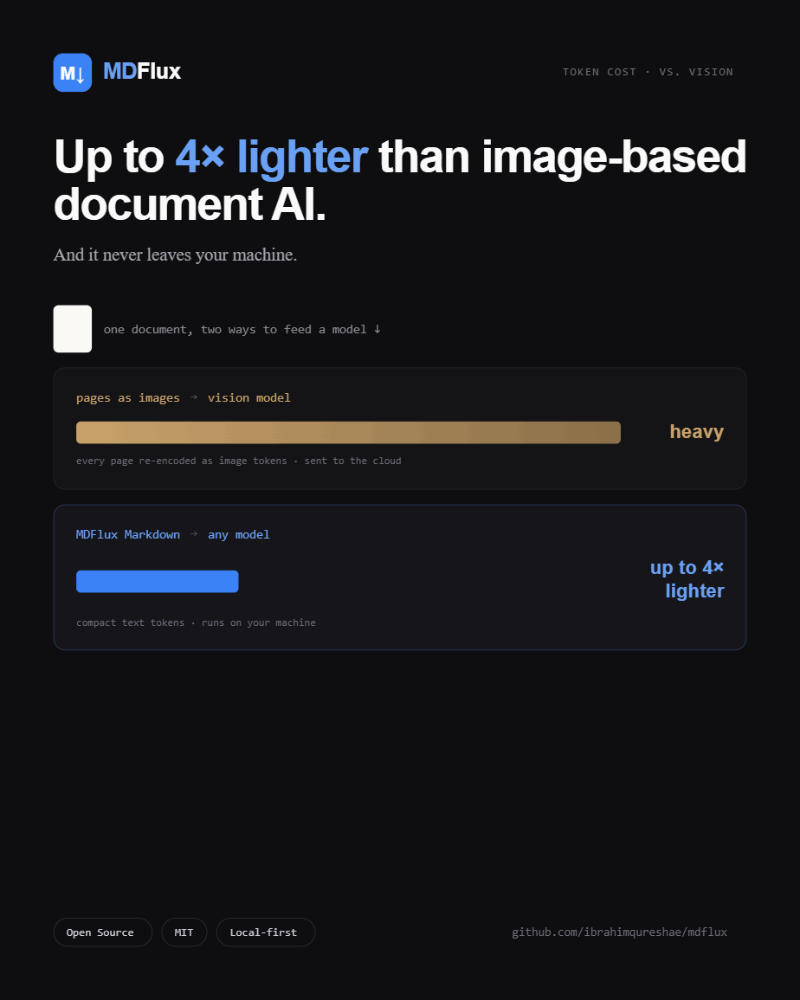
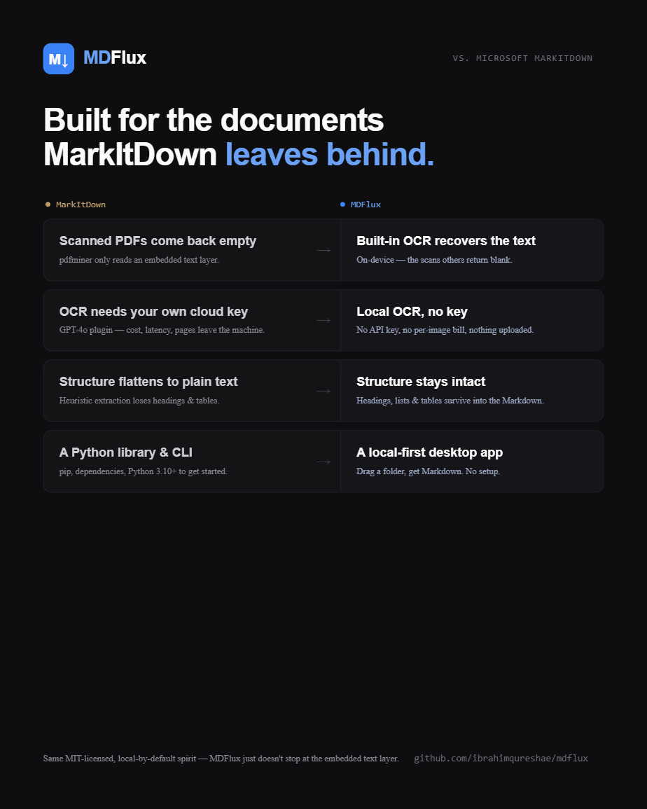
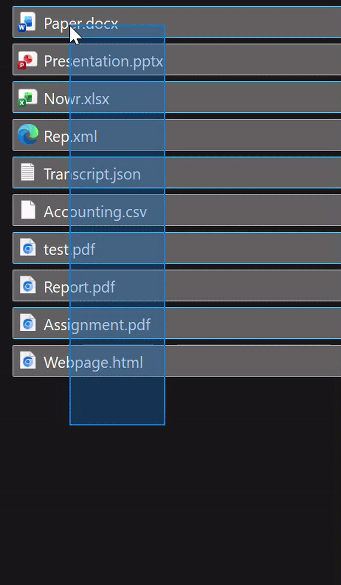

<div align="center">


# MDFlux

**Turn any document into clean, AI-ready Markdown.**
Local-first · reads scanned PDFs · up to 6× fewer tokens than vision models

[](LICENSE)
[](https://github.com/ibrahimqureshae/mdflux/releases/latest)
[](https://github.com/ibrahimqureshae/mdflux/actions)
[](#the-proof-fewer-tokens-lower-cost)
[](https://github.com/ibrahimqureshae/mdflux/releases)
[](#)

[**⬇️ Download for Windows**](https://github.com/ibrahimqureshae/mdflux/releases/latest)
&nbsp;&nbsp;·&nbsp;&nbsp;
[The proof](#the-proof-fewer-tokens-lower-cost)
&nbsp;&nbsp;·&nbsp;&nbsp;
[How it compares](#how-it-compares-to-microsoft-markitdown)
&nbsp;&nbsp;·&nbsp;&nbsp;
[Report a bug](https://github.com/ibrahimqureshae/mdflux/issues)
&nbsp;&nbsp;·&nbsp;&nbsp;
[❤️ Sponsor](https://github.com/sponsors/ibrahimqureshae)


</div>

---

## Why MDFlux?

Getting a document into a shape an LLM can use is more annoying than it should be. You either dump the raw text and lose every heading, table, and list, or you ship your pages to a cloud vision model as images, which means your documents leave your machine and you pay by the page to read your own files. And scanned PDFs? Plain text extractors just hand you back nothing. The text is right there, and the tool acts like the page is blank.

MDFlux is what I wanted instead. Drop in a file or a folder and get back clean, structured Markdown, with OCR for those "blank" scanned pages, batch processing for a whole directory, and an optional cleanup pass to tidy up messy extraction. It runs entirely on your machine. It's built on Microsoft's [MarkItDown](https://github.com/microsoft/markitdown), with everything around it that makes the engine actually usable day to day.

---

## The proof: fewer tokens, lower cost

Every time a document gets read by an LLM, you pay for it in tokens. The common way to feed a document to a model is to send its pages as images to a vision model, and images are an expensive way to spend tokens. MDFlux hands the model clean Markdown instead, which is far cheaper to read and reuse.

**About 2 to 6 times fewer tokens than vision.** For ordinary documents, MDFlux Markdown runs around 4 times lighter than sending the pages as images, and up to 5.7 times lighter on scanned pages. That saving lands on every single call that reads the document, so it compounds quickly across a pipeline or a large batch.

<div align="center">

</div>

**And it reads what other tools return empty.** Point a plain extractor at a scanned, image-only PDF and you get zero usable text. MDFlux's OCR recovers it, and even then it stays lighter than the vision route:

| Scanned, image-only PDF | Usable tokens of text |
|---|---:|
| Plain text extractor | 0 |
| Vision model (page as an image) | 10,731 |
| MDFlux (OCR to Markdown) | 1,893 |

That's the full text recovered in about 5.7 times fewer tokens than the vision model, which still has to OCR the image on its end anyway.

<div align="center">

[**⬇️ Download for Windows**](https://github.com/ibrahimqureshae/mdflux/releases/latest)
&nbsp;·&nbsp; Free &amp; MIT-licensed &nbsp;·&nbsp; No account, no cloud

</div>

---

## Key features

| | |
|---|---|
| 💸 **Fewer tokens, lower cost** | Clean Markdown costs about 2 to 6 times fewer tokens than sending pages to a vision model, so every LLM call that reads the document is cheaper. |
| 🔒 **Local and private** | Your documents never leave your machine. No cloud, no API key, no account. |
| 🔍 **Reads scanned PDFs** | Built-in OCR recovers text that plain extractors return as zero characters. |
| 🧱 **Real structure** | Proper Markdown with headings, tables, and lists intact. Readable, greppable, diff-able. |
| 🖥️ **No terminal needed** | Portable app. Unzip, run, click through a one-time setup. Done. |
| 📦 **Many formats** | PDF, DOCX, PPTX, XLSX, EPUB, HTML, CSV, JSON, XML, images, and audio. |
| 🔁 **Batch a whole folder** | Convert everything at once, with progress, cancellation, and per-file diagnostics. |
| 🧹 **Optional cleanup** | Off, rule-based, or a local AI pass to tidy up messy extractions. |

---

## Who it's for

🤖 **AI and RAG builders**: feed clean, structured source documents to any model instead of raw text or pricey vision tokens

🔬 **Researchers**: batch-convert papers, reports, and scanned archives into searchable Markdown

🧑‍💻 **Developers**: get diff-able, version-controllable text out of binary document formats

📝 **Writers and analysts**: pull clean copy out of PDFs and Office files without the formatting mess

🔒 **Privacy-conscious users**: convert sensitive contracts, records, and decks with nothing ever uploaded

---

## How it works

```
1. Drop a file or folder   →   PDF, Office, EPUB, scans, audio, and more
2. Pick a cleanup mode      →   Off, rule-based, or local AI
3. Get clean Markdown       →   Preview, copy, or save as .md. 100% offline.
```

The first launch sets up a private, self-contained Python environment (one time, needs internet). Every conversion after that runs fully offline.

---

## How it compares to Microsoft MarkItDown

MDFlux is built on Microsoft's [MarkItDown](https://github.com/microsoft/markitdown), which is a genuinely great conversion library. What MDFlux adds is everything around it: the OCR for scans, the desktop app, the batching, the reliability, and the privacy-by-default packaging that lets anyone run it against a folder of files without touching a command line.

<div align="center">

</div>

| | Microsoft MarkItDown | MDFlux |
|---|:---:|:---:|
| Core conversion engine | yes | yes (uses MarkItDown) |
| Scanned / image-only PDFs | returns roughly 0 characters | built-in OCR recovers the text |
| Install and run | `pip install` plus a terminal | portable app, no terminal |
| Dependency setup | manual (pip, ffmpeg, OCR extras) | sets itself up on first launch |
| Batch a whole folder | write your own script | built in, runs concurrently with progress |
| Timeouts and cancel | can hang with no feedback | every job streams progress and can be cancelled |
| Cleanup modes | raw output | Off, rule-based, or local AI cleanup |
| Preview and diagnostics | none | rendered preview plus a health panel |
| Audio transcription | plugin or Azure | local, built in |
| Privacy | local if you wire it up | local by default |

On already-clean files the output is close to identical, because under the hood it is MarkItDown. The point isn't to beat the engine. It's to make that engine genuinely usable.

<div align="center">
<sub>If MDFlux sounds useful, consider ⭐ starring the repo. It helps others find it.</sub>
</div>

---

## Getting started

**1. Download and run.** Get the portable zip from [Releases](https://github.com/ibrahimqureshae/mdflux/releases/latest), extract it anywhere, and double-click `MDFlux.exe`. No installer, no admin rights.

> **SmartScreen warning?** The build is open source and unsigned. Click "More info" then "Run anyway". You'll need the WebView2 runtime, already on current Windows 10/11.

**2. First launch (one-time, internet required).** MDFlux sets up a private, self-contained Python environment. This happens once. After that, it runs fully offline.

<div align="center">

</div>

**3. Convert.** Drop a document onto the window, pick a cleanup mode, and click "Convert to AI-Ready Markdown". Preview, copy, or save as `.md`. You can also batch a whole folder.

<div align="center">

</div>

To verify your download, check the SHA-256 posted on the [release page](https://github.com/ibrahimqureshae/mdflux/releases/latest).

---

## Supported formats

| Documents | Office | Web and data | Other |
|---|---|---|---|
| PDF (including scanned, via OCR) | DOCX | HTML | Audio to transcript |
| EPUB | PPTX | CSV, JSON, XML | OCR on embedded images |
| TXT, Markdown | XLSX | | |

---

## Troubleshooting

**"Windows protected your PC"**: That's SmartScreen reacting to an unsigned build. Click "More info" then "Run anyway". The build is open source; code signing is on the roadmap.

**The first launch is downloading for a while**: That's the one-time setup of the local Python environment. It only happens once, and every launch after is instant and offline.

**A conversion finished with a warning or looks empty**: Open the diagnostics panel. It tells you what's installed and healthy and what went wrong, so you get a clear next step instead of a silent empty file.

**Where are my converted files?** In the output folder shown in the app. For batch jobs you pick the folder up front.

**Anything else**: [Open an issue](https://github.com/ibrahimqureshae/mdflux/issues). Bug reports genuinely help.

---

## Roadmap

- [ ] MCP server, so Claude Code and other agents can convert documents through MDFlux directly
- [ ] CLI for scripted, headless conversion in pipelines and CI
- [ ] macOS build (arm64 and Intel)
- [ ] Code signing, to remove the SmartScreen warning
- [ ] More OCR languages and tuning presets

The full list lives in [ROADMAP.md](ROADMAP.md). Open an issue if you want to shape it.

---

## For developers

MDFlux is a Tauri 2 (Rust) shell around a Python sidecar (MarkItDown + OCR + audio), with a Svelte 5 front end. Clone it, run `npm install`, then `npm run tauri dev`. See [CONTRIBUTING.md](CONTRIBUTING.md) for the full build, run, and test steps, the project layout, and the tech stack.

---

## Contributing

Contributions are genuinely welcome. Honestly, it's the main reason I'm open-sourcing this. Bug reports, ideas, code, and testing on different hardware all help.

Start with a [good first issue](https://github.com/ibrahimqureshae/mdflux/labels/good%20first%20issue), and see [CONTRIBUTING.md](CONTRIBUTING.md) to get a dev build running. Commits use a [DCO](CONTRIBUTING.md) sign-off (`git commit -s`). Be kind; we follow a [Code of Conduct](CODE_OF_CONDUCT.md).

---

## Support the project

MDFlux is free and MIT-licensed. If it saves you time, supporting it goes straight into the roadmap above: the macOS build, code signing, and the MCP server and CLI.

<p align="center">
  <a href="https://github.com/sponsors/ibrahimqureshae">
    
  </a>
  &nbsp;&nbsp;
  <a href="https://buymeacoffee.com/mibrahim99">
    
  </a>
</p>

And starring the repo is free, which helps more than you'd think.

---

## License

MIT, copyright 2026 ibrahimqureshae. Free to use, modify, and distribute. See [LICENSE](LICENSE).

---

<div align="center">
Built on open-source foundations: <a href="https://github.com/microsoft/markitdown">MarkItDown</a> · <a href="https://tauri.app/">Tauri</a> · <a href="https://github.com/RapidAI/RapidOCR">RapidOCR</a> · <a href="https://github.com/pypdfium2-team/pypdfium2">pypdfium2</a>

<br/>

<a href="https://claude.com/claude-code"></a>
</div>
