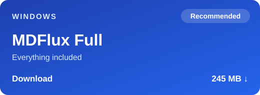
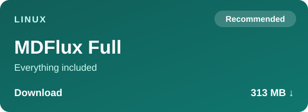
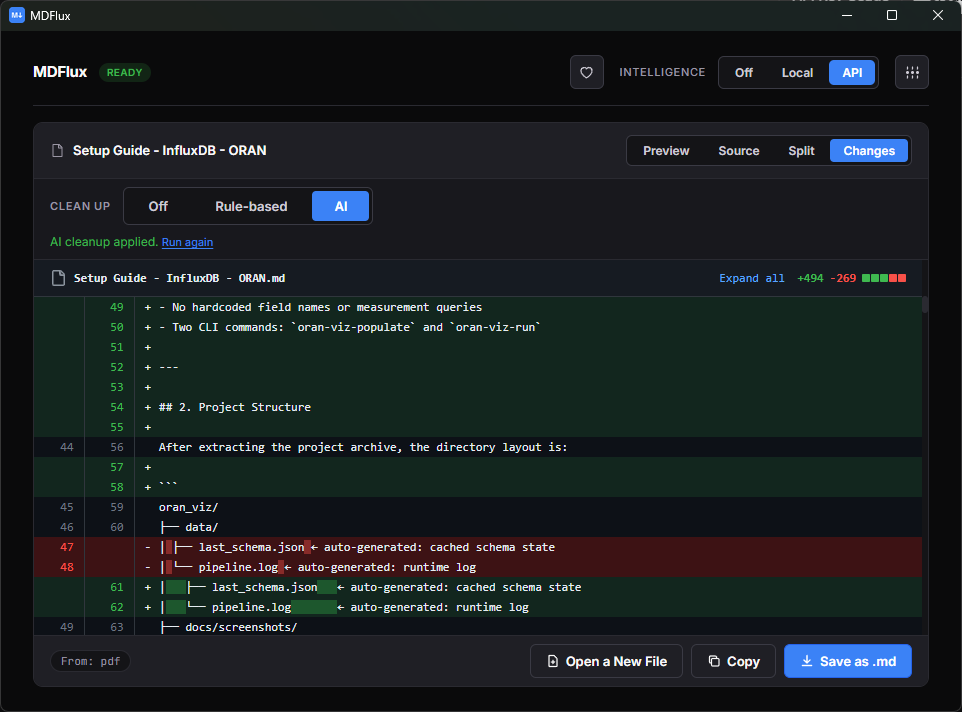

<div align="center">


# MDFlux

**Turn documents into clean, AI-ready Markdown.**

Runs on your computer · Reads scanned PDFs · No account required

PDF · Word · PowerPoint · Excel · EPUB · HTML · Images · Audio · Data files

[](LICENSE)
[](https://github.com/ibrahimqureshae/mdflux/releases/latest)
[-3b82f6.svg)](https://github.com/ibrahimqureshae/mdflux/releases)
[](https://github.com/ibrahimqureshae/mdflux/stargazers)


</div>

## Download MDFlux

For the easiest setup, download **Full**. Everything needed for document conversion and OCR is included in one download.

<div align="center">

<a href="https://github.com/ibrahimqureshae/mdflux/releases/latest/download/MDFlux_0.3.0_windows_x64_full.zip">
  
</a>

<a href="https://github.com/ibrahimqureshae/mdflux/releases/latest/download/MDFlux_0.3.0_linux_x64_glibc_full.tar.gz">
  
</a>

**Not sure which edition to choose? Download Full.**

Everything is packaged together, so there are no additional MDFlux setup downloads when you open it.

Prefer a smaller first download?
[Windows Lite (4.9 MB)](https://github.com/ibrahimqureshae/mdflux/releases/latest/download/MDFlux_0.3.0_windows_x64_lite.zip) ·
[Linux Lite (5.8 MB)](https://github.com/ibrahimqureshae/mdflux/releases/latest/download/MDFlux_0.3.0_linux_x64_glibc_lite.tar.gz)

Lite downloads and installs the required components when you first open it.

[View all release files](https://github.com/ibrahimqureshae/mdflux/releases/latest) ·
[Verify your download](docs/cross-platform/releases-and-verification.md) ·
[Website](https://ibrahimqureshae.github.io/mdflux/)

</div>

## Get started

### Windows

1. Download **MDFlux Full for Windows**.
2. Extract the ZIP file.
3. Open `MDFlux.exe`.
4. Drop in a file or folder and select **Convert to AI-Ready Markdown**.

Windows may display a SmartScreen message because MDFlux is currently unsigned. Select **More info**, then **Run anyway**.

No installer or administrator access is required.

### Linux

MDFlux supports x64 Linux systems based on Ubuntu 22.04 or newer.

Install the required system libraries:

```bash
sudo apt install libwebkit2gtk-4.1-0 libgtk-3-0 xdg-utils
```

Then:

1. Download **MDFlux Full for Linux**.
2. Extract the archive.
3. Run `./MDFlux`.
4. Drop in a file or folder and start converting.

Linux system libraries are provided by your operating system and are not included in either MDFlux edition.

## What MDFlux does

MDFlux converts documents into structured Markdown that is easier to read, edit, search, and use with AI tools.

| Feature | What it means for you |
|---|---|
| 🔒 Local conversion | Your documents stay on your computer |
| 🔍 Scanned PDF support | Built-in OCR recovers text from image-only files |
| 🧱 Document structure | Headings, tables, lists, and links are preserved |
| 🔁 Batch conversion | Convert a complete folder in one job |
| ⏹️ Progress and cancellation | See what is happening and stop any job |
| 🧹 Optional cleanup | Use rules, local AI, or an API provider |
| 📝 Changes view | See exactly what cleanup added or removed |
| 📦 Portable app | Extract and run without an installer |

## Supported formats

| Category | Formats |
|---|---|
| Documents | PDF, scanned PDF, EPUB, TXT, Markdown |
| Microsoft Office | DOCX, PPTX, XLSX, XLS |
| Web and data | HTML, CSV, JSON, XML |
| Images | PNG, JPG, GIF, WEBP, TIFF, BMP |
| Audio | MP3, WAV, M4A, OGG, FLAC, AAC |

Speech recognition model files are downloaded separately when first used.

## Why use MDFlux?

Traditional text extractors can lose headings, tables, and lists. Scanned PDFs may produce no text at all. Sending every page to a vision model can also increase cost and send private documents to an external service.

MDFlux converts files locally and uses OCR when needed.

| Scanned PDF method | Usable tokens |
|---|---:|
| Plain text extraction | 0 |
| Vision model | 10,731 |
| MDFlux OCR | 1,893 |

In this test, MDFlux produced usable Markdown with about 5.7 times fewer tokens than sending the page as an image.

## Cleanup options

Cleanup is optional.

- **Off:** Keep the extracted Markdown unchanged.
- **Rules:** Apply local formatting improvements.
- **Local AI:** Clean the result using a model running on your computer.
- **API:** Use OpenAI, DeepSeek, Groq, OpenRouter, or a compatible provider.

The **Changes** tab shows what was added or removed.

<div align="center">




</div>

## Full and Lite editions

Both editions provide the same MDFlux features.

| | Full | Lite |
|---|---|---|
| Recommended for | Most users | Users wanting a smaller initial download |
| Initial download | Larger | Smaller |
| First launch | Ready immediately | Downloads required components |
| Document conversion after setup | Offline | Offline |
| Setup repair | Included | Included |

Full includes the runtime and dependencies required for core conversion and OCR.

Speech recognition model files remain separate downloads in both editions.

## Troubleshooting

### Windows protected your PC

MDFlux is open source but currently unsigned. Select **More info**, then **Run anyway**.

### Linux reports a missing WebKit or GTK library

Install the required packages:

```bash
sudo apt install libwebkit2gtk-4.1-0 libgtk-3-0 xdg-utils
```

### Lite is downloading files during the first launch

This is expected. Lite installs its private runtime when first opened.

Use the Full edition if you want everything packaged in the initial download.

### AI cleanup reports an authentication error

Open **Diagnostics** and confirm that the selected provider matches your API key.

### A conversion is empty or displays a warning

Open **Diagnostics** for information about missing components or conversion errors.

### Where are my Markdown files?

The destination appears in the MDFlux window. For folder conversions, you select the output folder before starting.

Still need help? [Open an issue](https://github.com/ibrahimqureshae/mdflux/issues).

## What’s new in v0.3.0

- MDFlux is now available for Windows and Linux.
- Full and Lite editions are available for both platforms.
- Full packages everything required for core conversion and OCR.
- Lite setup is recoverable if a download is interrupted.
- OCR, AI cleanup, errors, and diagnostics are more reliable.

See the complete [changelog](CHANGELOG.md).

## Documentation

- [Edition details](docs/cross-platform/editions.md)
- [Supported platforms](docs/cross-platform/platforms-and-support.md)
- [Download verification](docs/cross-platform/releases-and-verification.md)
- [Roadmap](ROADMAP.md)
- [Contributing](CONTRIBUTING.md)
- [Security policy](SECURITY.md)

## For developers

MDFlux is built with Tauri 2, Svelte 5, Python, and Microsoft MarkItDown.

Requirements:

- Node.js 20 or newer
- Stable Rust
- Python development environment

Run the development build:

```bash
npm install
npm run tauri dev
```

Please read [CONTRIBUTING.md](CONTRIBUTING.md) before submitting changes. Commits use `git commit -s`.

## Support MDFlux

MDFlux is free and MIT licensed. If it saves you time, you can support continued work on macOS, code signing, the CLI, and MCP integration.

<p align="center">
  <a href="https://github.com/sponsors/ibrahimqureshae">
    
  </a>
  &nbsp;&nbsp;
  <a href="https://buymeacoffee.com/mibrahim99">
    
  </a>
  &nbsp;&nbsp;
  <a href="https://www.paypal.me/mibrahimqr">
    
  </a>
</p>

Starring the repository is free and helps people find MDFlux.

## License

MDFlux is available under the [MIT License](LICENSE).

Built on [Microsoft MarkItDown](https://github.com/microsoft/markitdown).
